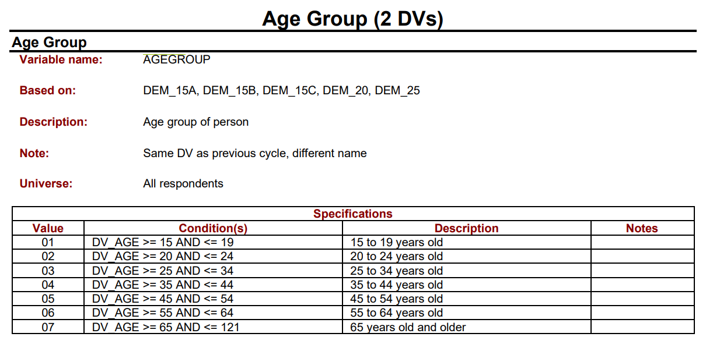
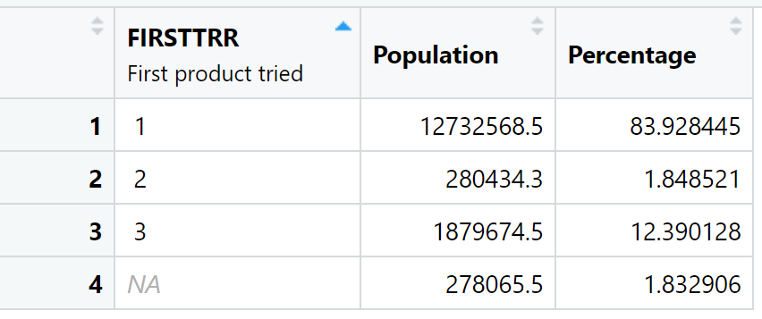
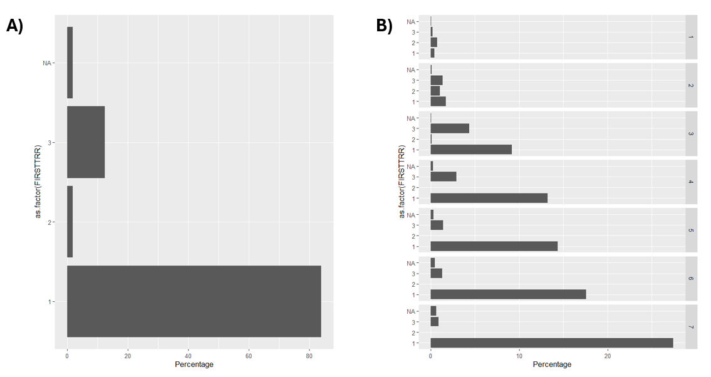
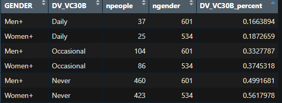
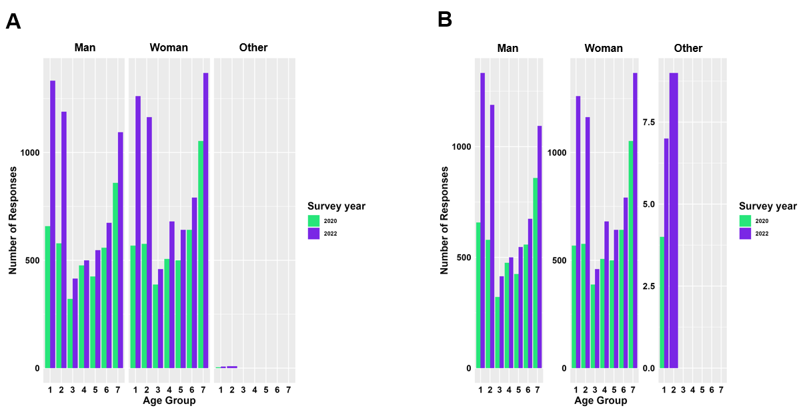

#Datasets for today's workshop

We are working with two years (<a href="https://hdl.handle.net/11272.1/AB2/UYC0Z8" target="_blank">2020</a> and <a href="https://hdl.handle.net/11272.1/AB2/PWWFK3" target="_blank">2022</a>) of the Canadian Tobacco, Alcohol and Drugs Survey available on abacus.

We will start with the 2022 dataset, then combine it with the 2020 dataset later to practice working with two datasets.

## Reading in plain text data into R

``` r
## load packages
library(tidyverse)
library(plyr)

# 2020 survey data
tab2020 = read.csv("ctns.csv")
# 2022 survey data
tab2022 = read.csv("CTNS2022_P.csv")
```

## Reducing clutter

Use the select function to only keep the columns of interest. This is not necessary, but it increases the readability of the dataframe for you and also can also save computing power and disk storage space down the line. 
``` r
tab2022 = select(tab2022, "AGEGROUP", "GENDER", "TBC_05A", "FIRSTTRR", "DV_VC30B")
```

## Participant demographic data

Lets make an initial graph to look at the participant age breakdown of the survey.

``` r
ggplot(tab2022, aes(x=as.factor(AGEGROUP), group=GENDER, fill=as.character(GENDER)))+
  geom_bar(position = "dodge")+
  scale_fill_manual(values=c("#27E57A", "#7A27E5", "#E57A27"))+
  labs(x="Age Group", y="Number of Responses", fill="Gender")
```




Is this the actual age breakdown of the Canadian population?

<a href="https://publications.gc.ca/Collection/Statcan/96F0030X/96F0030XIE2001002.pdf" target="_blank">No!</a> Often, survey data is analyzed by looking at statistical weight.

Another example of statistical weighting, the survey data we have loaded in has statistical weight by province included as a column. Depending on your study question, you may want to weight participant responses.

## Example questions

### Of the people who currently smoke cigarettes, what percent of them first tried cigarettes?

``` r
## only keep current smokers
cig = subset(tab2022, tab2022$TBC_05A=="1")

## make a summary table by the first thing participants tried smoking
try = ddply(cig, c("FIRSTTRR"),
            summarise,
            npeople = length(TBC_05A)) 

## how many people total
totalresponses = sum(try$npeople)

## percent of first try
try$FIRSTTRR_percent = (try$npeople/totalresponses)*100

## make the table readable 
try$FIRSTTRR = str_replace_all(try$FIRSTTRR, c("1"="cig", "2"="e-cig/vape", "3"="cannabis", "9"="not started", "6"="valid skip"))

## generate table
knitr::kable(try)
```



Overall, we see that of the people who currently smoke cigarettes, most of them first smoked cigarettes.

There is a problem here. [E-cigarettes/vapes were only invented in 2003,](https://en.wikipedia.org/wiki/Electronic_cigarette#:~:text=investigation%20is%20ongoing.-,History,since%20as%20early%20as%201963.) so our current table could be biased by age, with older people not having access to e-cigarettes as a "first try option" when they were younger.

``` r
## make a summary table by the first thing participants tried smoking by age group
try.by.age = ddply(cig, c("FIRSTTRR", "AGEGROUP"),
            summarise,
            npeople = length(TBC_05A))

## get the total number of participants per age group
age.totals = ddply(try.by.age, c("AGEGROUP"),
            summarise,
            npeople.by.age = sum(npeople))

## join the data to combine the info
try.age = full_join(try.by.age, age.totals)

## get the percent within the age groups
try.age$FIRSTTRR_percent = (try.age$npeople/try.age$npeople.by.age)*100

## make the table readable 
try.age$FIRSTTRR = str_replace_all(try.age$FIRSTTRR, c("1"="cig", "2"="e-cig/vape", "3"="cannabis", "9"="not started", "6"="valid skip"))
try.age$AGEGROUP = str_replace_all(try.age$AGEGROUP, c("1"="fifteen", "2"="twenty", "3"="twenty-five", "4"="thirty-five", "5"="forty-five", "6"="fifty-five", "7"="sixty-five"))

## generate table
knitr::kable(try.age)
```



Again, we see here the importance of considering demographic variables when analyzing survey data but we add the additional element of considering the context where the behaviour of interest would have occurred.

### What percentage of people aged 20 to 24 who vape, vape cannabis?

``` r
## only keep target age group that vape
ag20to24 = subset(tab2022, tab2022$AGEGROUP=="2" & tab2022$VAP_10R %in% c(1, 2, 3))

## make summary table by gender
agesum = ddply(ag20to24, c("GENDER", "DV_VC30B"),
               summarise,
               npeople = length(VAP_10R))

## get the total participant numbers
genderbreakdown = ddply(agesum, c("GENDER"),
                         summarise,
                         ngender = sum(npeople))

## join dataframes together
agesum.percent = full_join(agesum, genderbreakdown)

## calculate the percent
agesum.percent$DV_VC30B_percent = (agesum.percent$DV_VC30B/agesum.percent$ngender)*100


## make the table readable
agesum.percent$GENDER = str_replace_all(agesum.percent$GENDER, c("1"="Men+", "2"="Women+", "9"="no response"))
agesum.percent$DV_VC30B = str_replace_all(agesum.percent$DV_VC30B , c("1"="Daily", "2"="Occasional", "3"="Never"))

## generate table
knitr::kable(agesum)
```



## Working with two years of data.

Often, your data will be in multiple separate files that need to be combined prior to analysis. The UBC libraries offers <a href="https://ubc-library-rc.github.io/relational-data-r/" target="_blank">workshops</a> on how to join datasets in R.

Working with many years is challenging. The variable names and data format can change year to year, so it is important to read the user guide for each year and to re-format your data accordingly.

Here, we will demonstrate combining two datasets (2020 and 2022) and just work with the columns that merge properly without additional formatting.

``` r
## add survey year indicator
tab2022$survey_year = 2022
tab2020$survey_year = 2020
## join tables (datasets)
tab = full_join(tab2022, tab2020)

## check no rows were missed or added
## rows in 2020
print(nrow(tab2020))
## rows in 2022
print(nrow(tab2022))
## total of new rows
nobservations = nrow(tab2020)+nrow(tab2022)
print(nobservations)
```

### How does the age group and gender breakdown compare between the two surveys?

``` r
## Plot A
ggplot(tab, aes(x=as.factor(AGEGROUP), fill=as.factor(survey_year)))+
  geom_bar(position = "dodge")+
  labs(x="Age Group", y="Number of Responses", fill="Survey year")+
  facet_wrap(.~GENDER)+
  scale_fill_manual(values=c("#27E57A", "#7A27E5"))

## Plot B
ggplot(tab, aes(x=as.factor(AGEGROUP), fill=as.factor(survey_year)))+
  geom_bar(position = "dodge")+
  labs(x="Age Group", y="Number of Responses", fill="Survey year")+
  facet_wrap(.~GENDER, scales="free_y") ##"free" lets both axes vary. We use "free_y" to only let the y-axis vary
  scale_fill_manual(values=c("#27E57A", "#7A27E5"))

```



What do you notice about this plot?

-   Statistical weights

-   Overall participant numbers

-   Gender breakdown

Comparing datasets at this broad level allows us to set up our analyses correctly. For help on how to account or different sample sizes and other statistical questions, see the <a href="https://www.stat.ubc.ca/how-can-you-get-help-your-data" target="_blank">UBC statistics department.</a>

## Reading in sav files into R

``` r
## load packages
library(haven)

sav2022 = read_sav("ctns_2020_pumf_bsw_eng.sav")
```


