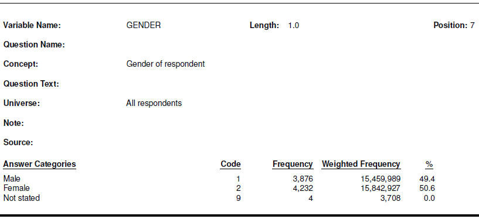

# Orientation to the CTNS 

The example in this workshop is the _Canadian Tobacco and Nicotine Survey (CTNS)_ from Statistics Canada. We will use the CTNS PUMF for two survey years available in Abacus:

- [2020 CTNS PUMF](https://hdl.handle.net/11272.1/AB2/UYC0Z8){:target="_blank"}
- [2022 CTNS PUMF](https://hdl.handle.net/11272.1/AB2/PWWFK3){:target="_blank"}

## Documentation
Before analyzing the data it's important to read the documentation. Good survey documentation will answer these and other questions:

- What is the survey's purpose? 
- What is the target population?
- When was data collected?
- How were questions asked?
- What variables are available?

The CTNS PUMFs in Abacus come with _user guides_, _codebooks_, and/or _questionnaires_ that will help you interpret the data and avoid mistakes in your analysis.

All PUMFs will have some way to identify variables, whether it's a _codebook_, _data dictionary_ or other reference file. _User guides_ and _questionnaires_ are not always present.
{: .note}

### User guide
The user guide usually begins with a description of the survey and includes sections on definitions, methodology, data collection, and more. Here's an excerpt from the survey description in the [CTNS 2022 user guide](https://hdl.handle.net/11272.1/AB2/PWWFK3/QCE9VZ){:target="_blank"} (p7).

> _The main objective of the Canadian Tobacco and Nicotine Survey (CTNS) is to gather information about the prevalence of cigarette smoking, vaping, cannabis and alcohol use._

> _Understanding Canadian trends in tobacco, nicotine, cannabis, and alcohol use is vital to the effective development, implementation and evaluation of national and provincial strategies, policies and programs. The CTNS was conducted by Statistics Canada in late 2022 and early 2023 with the cooperation and support of Health Canada._

### Codebook
A _codebook_ lists all the variables in the PUMF along with:

- answer categories _(possible answers to the question)_
- frequencies _(the number of responses for each category)_
- weighted frequencies _(population estimate for each category)_

Here is the CTNS 2020 cobebook entry for the GENDER variable:

## Weights
The codebook frequencies lead us to a key concept: the survey *weight*. In a Statistics Canada PUMF each response represents a certain number of people in the target population. That number is represented by the weight variable.

The CTNS 2022 target population "is non-institutionalized persons aged 15 years or older living in Canada's ten provinces, who are not members of collectives or living on reserves" _([CTNS 2022 User Guide](https://hdl.handle.net/11272.1/AB2/PWWFK3/QCE9VZ){:target="_blank"}, p9)_
{: .note}

An analysis based on the number of responses will tell us about the survey _sample_ (e.g. X people who answered the survey are current smokers). More often we want to produce estimates of the population (e.g. X people in the target population are current smokers).

**WTPP** is the weight variable for the CTNS. In most cases our analysis should be based on the _sum_ of the WTPP variable, not on the count of records.  

## Selected CTNS variables, 2020 and 2022
Below are selected variables we will use when we analyze the CTNS PUMF in R. Take a moment to familiarize yourself with them, and notice the differences between the 2020 and 2022 survey years. 

### CTNS 2020

| variable | notes                                                  |
|----------|--------------------------------------------------------|
| AGEGROUP | age groups from 15 to 65+                              |
| DV_SSR   | smoking status (current/former/never) **DV_SS in 2022**  |
| GENDER   | binary variable, confuses gender and sex (Female/Male) |
| HHLDSIZE | household size from 1 to 5+                            |
| PROV_C   | province                                               |
| WTPP     | survey weight                                          |

### CTNS 2022

| variable   | notes                                                                        |
|------------------------|------------------------------------------------|
| AGEGROUP   | age groups from 15 to 65+                                                    |
| DV_SS      | smoking status (current/former/never) **DV_SSR in 2020**                       |
| GENDER     | acknowledges non-binary identities but groups them for privacy (Women+/Men+) |
| *HHLDSIZE* | **not available in 2022 PUMF**                                                 |
| PROV_C     | province                                                                     |
| WTPP       | survey weight                                          |

When there are difference between years the researcher will need to decide whether comparisons are possible. There are three differences among these variables:
- **HHLDSIZE** the household size variable is present in the 2020 PUMF, but not in 2022
- **DV_SSR** and **DV_SS** are different names for the same smoking status variable
- **GENDER** the 2022 gender variable allows non-binary gender identities, but only two categories are reported in the PUMF 

_How would **you** handle these differences?_
